# Finance Tracker

A self-hosted personal finance tracker built with **Flask** and **SQLite**. It records expenses and
income, follows your net worth month by month, and turns the data into interactive dashboards,
heat-map tables and flow charts — all in a single-user, dark-themed web app.

> The interface is in **Italian**, so the screenshots below show Italian labels (Spese = expenses,
> Entrate = income, Risparmio = savings, Patrimonio = net worth, Spese previste = planned expenses).
> All data shown is synthetic: it comes from the demo database generated by
> [`scripts/make_demo_db.py`](scripts/make_demo_db.py).

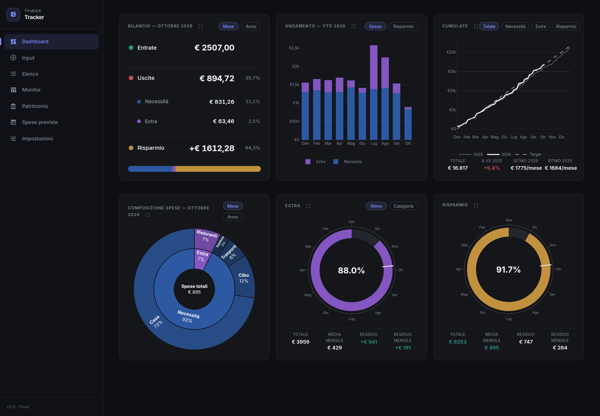

## Contents

- [Features](#features)
- [Screens](#screens)
- [Getting started](#getting-started)
- [Users and access](#users-and-access)
- [Configuration](#configuration)
- [How it works](#how-it-works)
- [Data model](#data-model)
- [Project structure](#project-structure)
- [Regenerating the screenshots](#regenerating-the-screenshots)
- [Limitations](#limitations)

## Features

- **Dashboard** – six panels that always show "now": monthly/yearly balance, year-to-date trend,
  cumulative spending (total / essential / extra / savings) compared with last year, spending
  composition (sunburst), extra-spending pace and savings goal progress.
- **Essential vs. extra spending** – every category is either *essential* (necessità) or *extra*;
  the whole app uses the same blue / purple colour coding for the two types.
- **Savings goal and extra budget** – set a yearly *or* monthly target in the settings; the
  dashboard shows progress as a ring with a "today" marker, so you can see at a glance whether you
  are ahead of or behind the calendar.
- **Monitor** – a month × category heat-map of your spending (monthly, yearly, monthly average or
  year-over-year change), absolute or as a percentage of income, with every column coloured on its
  own min–max scale. Click a cell to see the underlying expenses.
- **Charts** – the dashboard charts large and with more detail (flow, composition, monthly trend,
  cumulative with target, extra by category, savings goal), for YTD, the last 5 years, all data, or a
  single year.
- **Net worth** – monthly snapshots over predefined *slots* (liquidity, emergency fund, short/long
  term, pension, TFR, other investments, credits, liabilities) that you rename and show or hide, with a
  stacked area chart and a colour-scaled table. You choose which groups count in the total.
- **Planned expenses** – a scrolling calendar grid (4 or 12 months) of reminders for upcoming
  expenses; convert one into a real expense with a click.
- **Recurring expenses** – rules that are inserted automatically or after confirmation.
- **Input & list** – fast forms to add expenses, income and net-worth snapshots, and a filterable,
  paginated list with edit / delete.
- **Notifications** – confirmations and warnings are toasts in the bottom-right corner (full width at the bottom on
  phones) that disappear on their own; errors are red, stay until dismissed and highlight the offending field.
  Esc closes the latest toast; the container is an ARIA live region so screen readers announce messages.
- **Responsive** – the sidebar collapses on small screens and wide tables scroll horizontally.

## Screens

### Dashboard

Six panels with their own switches (month / year, spending / savings, total / essential / extra /
savings…). Titles of the *Extra* and *Savings* panels link to the settings where the targets are
defined.


The same panels with their alternative views — spending / savings trend, extra spending by category and
cumulative savings against its target:

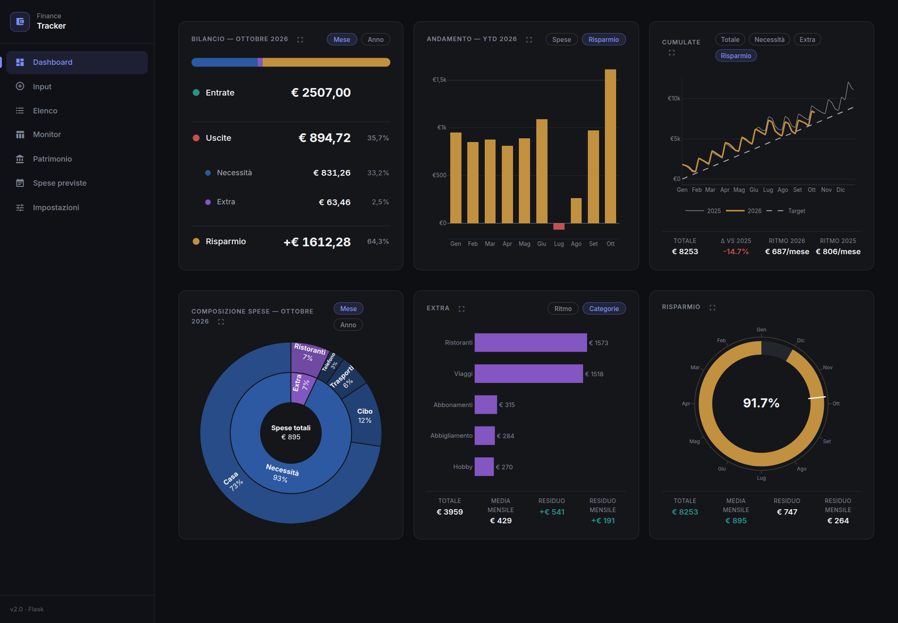

On a phone the panels stack into a single column:

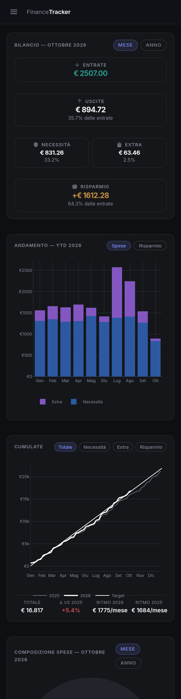

### Input

Add an expense, an income, a net-worth snapshot or a recurring-expense rule. Rules can be inserted
automatically on their day of the month or surfaced as a one-click confirmation.

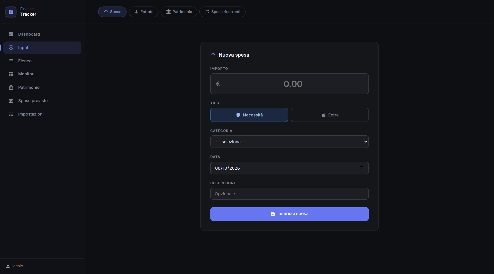

### List (Elenco)

All movements with filters (year, month, category, description search), colour accents by category
type, and edit / delete actions. The **CSV** button exports every row of the current selection (not just
the visible page) — UTF-8 with BOM, `;` as separator and a decimal comma, so Excel / LibreOffice in Italian
open it directly (in pandas: `read_csv(path, sep=';', decimal=',')`). The command bar stays fixed at the top while you scroll.

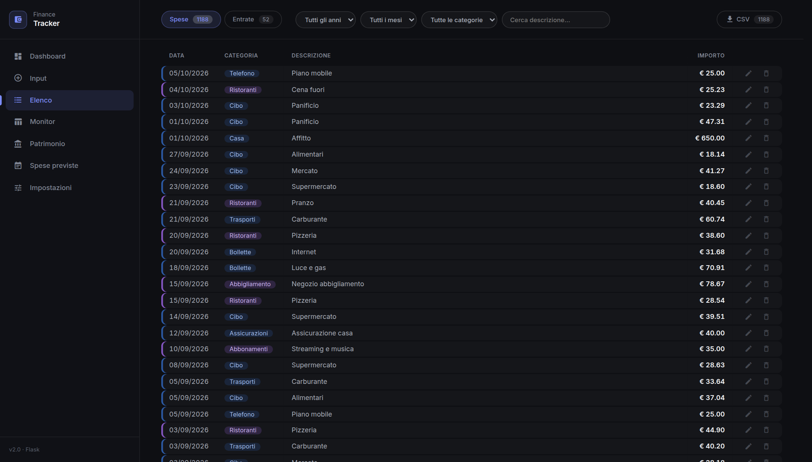

### Monitor

A heat-map of spending by month and category. Each cell is tinted according to its type (blue =
essential, purple = extra) and its value relative to the rest of the column. The side columns
summarise essential, extra, total spending, income and savings.

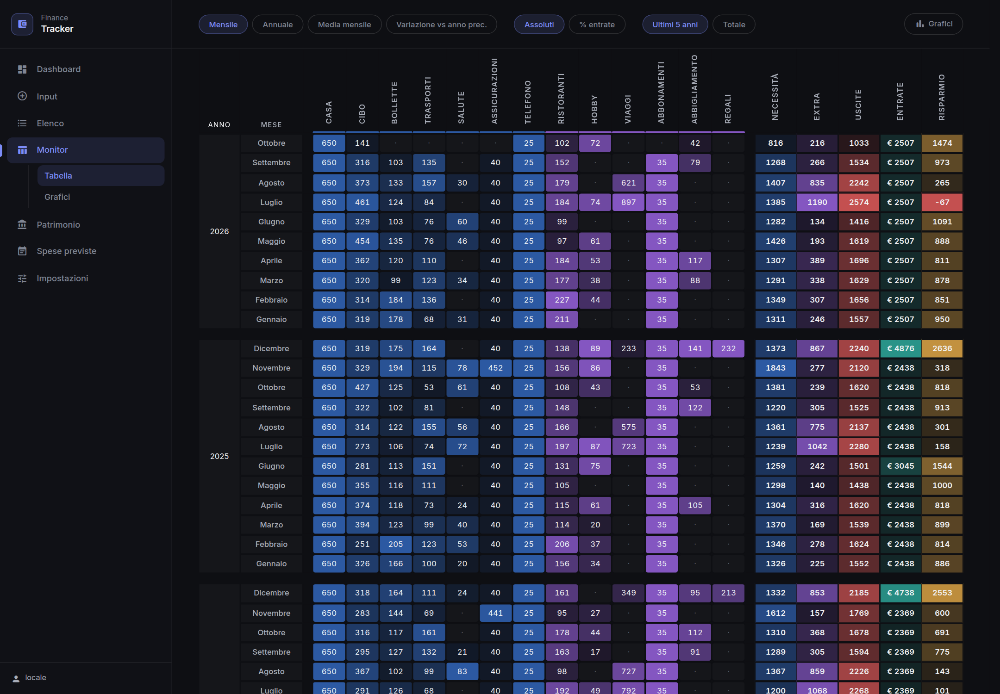

Switch between **monthly**, **yearly**, **monthly average** (completed months only for the current
year) and **change vs. previous year** views. In the change view, green means spending went down
(or income / savings went up) and red the opposite; the toggle switches between the difference in
euros per month and the percentage change.

| Monthly average | Change vs. previous year |
| --- | --- |
| 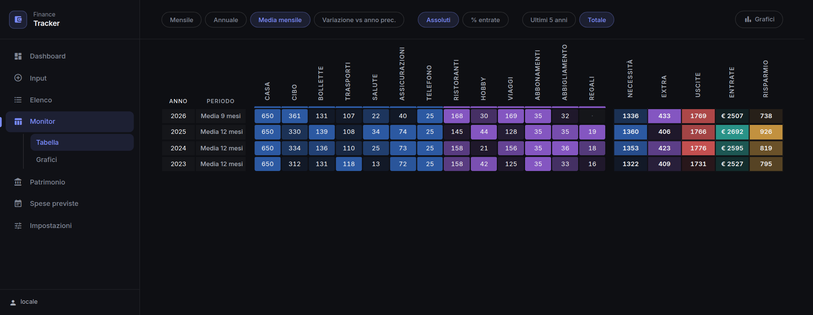 | 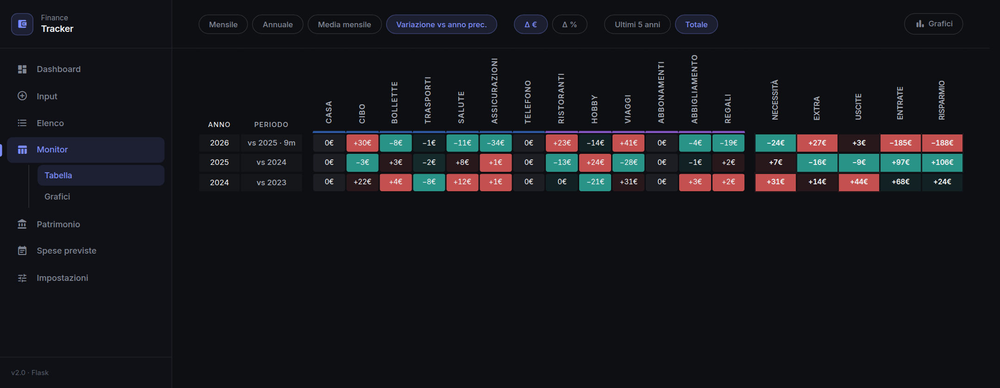 |

### Charts (Grafici)

Reached from *Monitor › Grafici* in the sidebar and from the expand icon in each dashboard panel title. Four tabs:

| Tab | Period | What it shows |
| --- | --- | --- |
| **Flow** | YTD, last 5 years, all, or a single year | Sankey income → savings / spending → essential / extra → categories; click a category to open its expenses |
| **Composition** | same | The same hierarchy as an interactive sunburst |
| **Trend** | same | Monthly bars — spending, savings (with the savings target of each year as a step line) or income vs. spending; the savings rate in the hover box, plus average spending and savings, overall savings rate and best / worst month; click a bar to open that month |
| **Cumulative** | one year (`‹ year ›`) | Total / essential / extra / savings — or **one category** — optionally against **any comparison year** (none by default) and the dashed target pace of that year |

The period control adapts to the tab: ranges for the first three, a single year for the cumulative one. The
budget and target are always those of the year shown. Each tab loads its own data on demand, so nothing
reloads; the state (tab, period, options) lives in the URL — links can be shared and the back button works —
and the last tab is remembered. Each chart has a PNG download button.

| Flow | Composition |
| --- | --- |
| 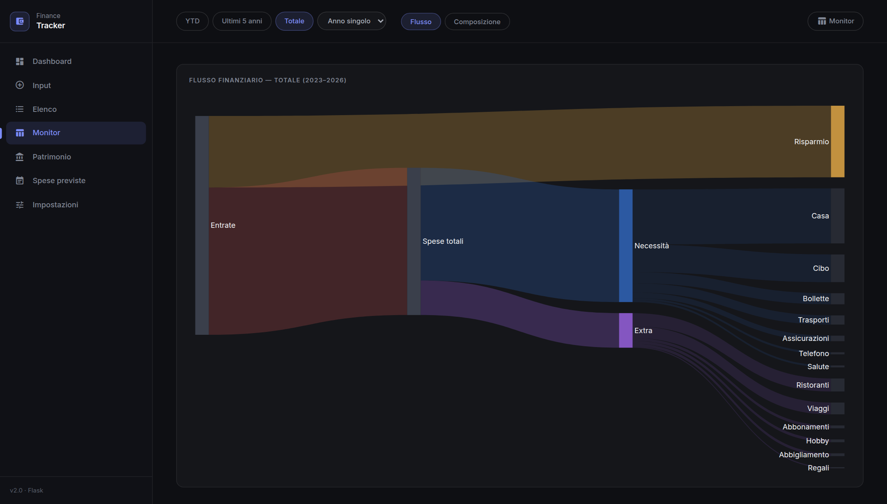 | 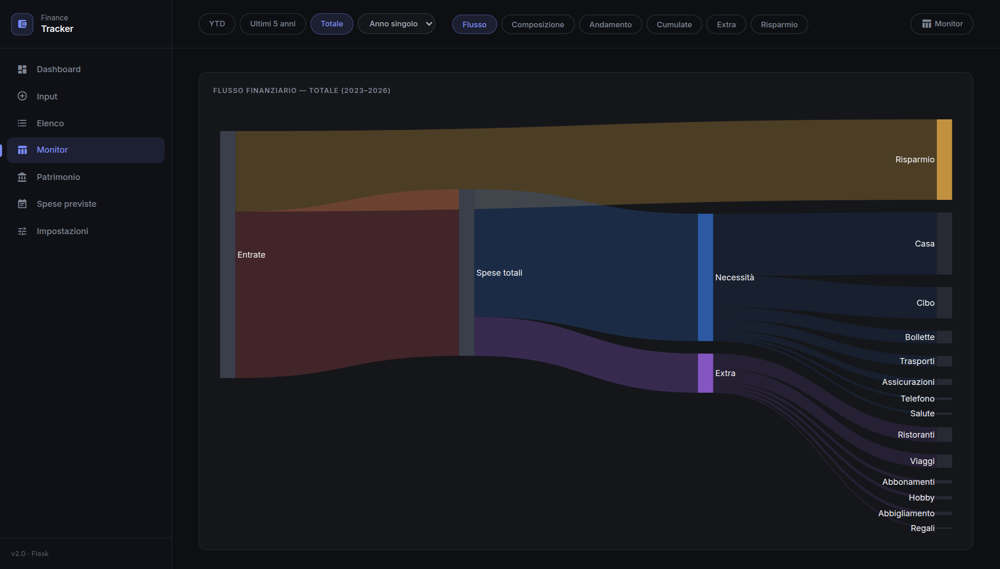 |

| Trend (savings) | Cumulative, one category vs. 2023 |
| --- | --- |
| 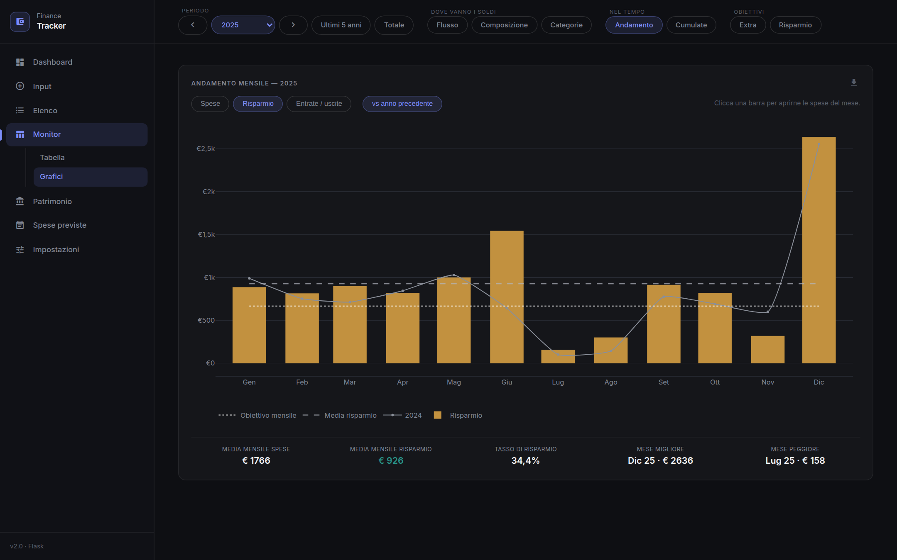 | 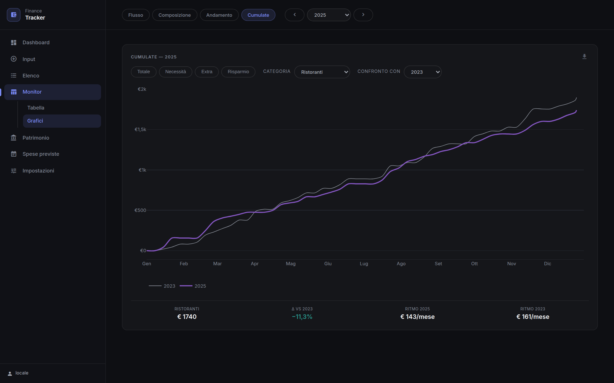 |

The composition tab needs non-negative savings (a child slice cannot be larger than its parent); when
spending exceeds income in the period the app says so and points to the flow tab.

### Net worth (Patrimonio)

Toggle the components on the stacked area chart with the pills at the top and pick the time window
with **6M / 1Y / 3Y / All**; the total of the visible components is labelled on the last point and
shown in the hover box. The table below uses the same colours as the chart, with intensity scaled per
column. On a phone the chart is shorter, uses sparser ticks and ignores touch drags so it never hijacks
page scrolling, and the command bar becomes a single swipeable row.

The structure is fixed but the names are yours: each group (liquidity, emergency fund, short term, long term,
pension, TFR, other investments, credits and deposits, liabilities) has a few slots you can rename and show or
hide (**Customize** on the page, or *Settings → Net worth*). Each group has a *counts in the total* switch, with
two presets: **Financial net worth** (liquidity + emergency + short + long term) and **Total net worth**
(everything, liabilities subtracted). Hiding a slot never removes its values from the totals.

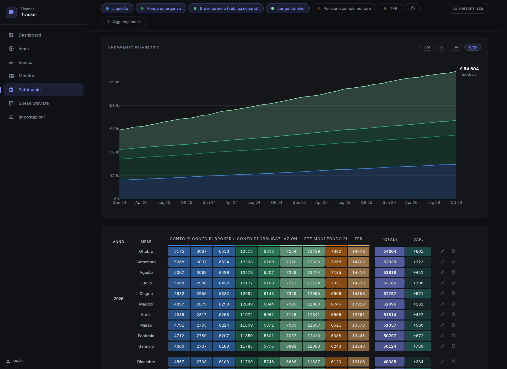

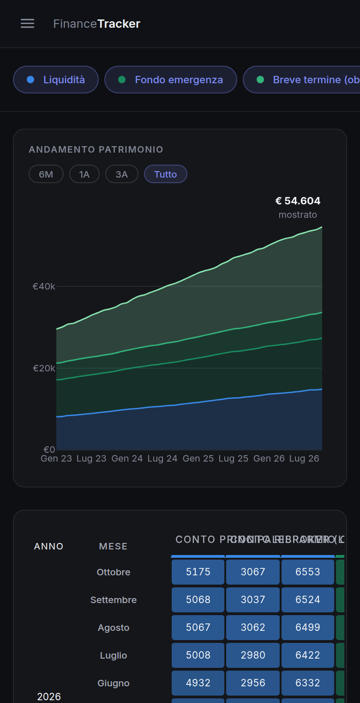

### Planned expenses (Spese previste)

A calendar-like grid of the coming months. Click a month to add an item (amount, description, optional
category and due date). Items are tinted by type and each month shows separate essential / extra
totals. Planned expenses are **reminders only**: they never appear in the list or in any statistic
until you convert them (✓) into a real expense.

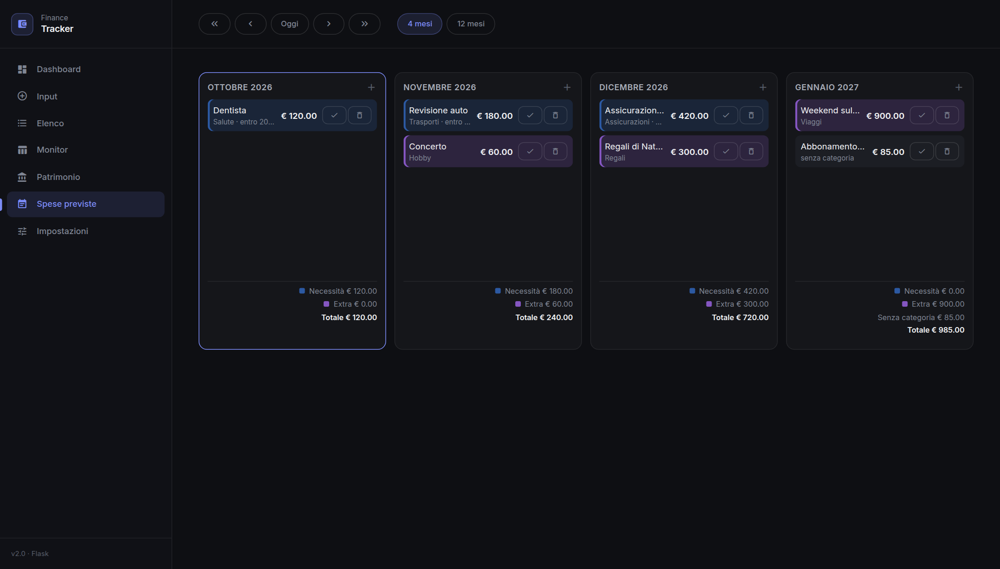

### Settings

Add categories and set the **budget** — essential spending, extra spending and the savings goal, each
as a monthly or yearly amount, **separately for each year** (an year without its own budget inherits the
previous year's until you save one). The budget drives the *Extra* and *Savings* panels and the dashed grey
**target pace line** in the *Cumulate* charts (total target = essential + extra).

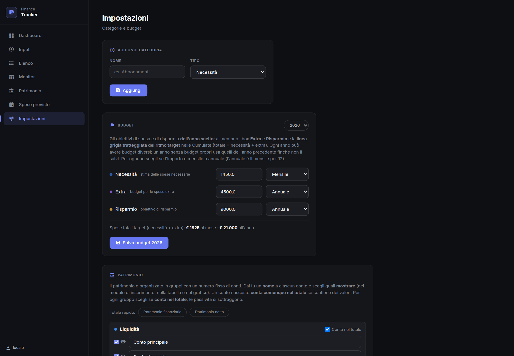

## Getting started

Requirements: Python 3.10+ and a modern browser with internet access (Plotly.js, the Inter font and
the Material icons are loaded from CDNs).

```bash
git clone git@github.com:ncldlbn/finance_app.git
cd finance_app

python -m venv venv
source venv/bin/activate          # Windows: venv\Scripts\activate
pip install -r requirements.txt

FINANCE_LOCAL=1 python app.py     # http://127.0.0.1:5000 (local mode, see "Password")
```

### Try it with demo data

No data of your own yet? Generate a database filled with synthetic data and point the app at it:

```bash
python scripts/make_demo_db.py demo.db
FINANCE_LOCAL=1 FINANCE_DB=demo.db python app.py     # no users in this file: you are let in directly
```

### Starting from scratch

The app reads and writes `data/finance.db` (SQLite). If the file does not exist it is created, with all tables,
at the first start (see *Schema migrations* above). Categories are added from the settings page.

To import expenses from a CSV (`DD/MM/YYYY`, amounts like `€ 7,32`) see
[`import_spese.py`](import_spese.py).

## Users and access

The app is **personal** — you use it with your own account — but it is genuinely multi-user, so you can also hand
out a **demo account** with fake data without any risk to yours:

| Account | Data | Can modify? |
| --- | --- | --- |
| **You** (owner) | your real data | yes |
| **`demo`** | synthetic data, regenerated once a day so the current year always has content | **no, read-only** |
| any other user | its own, separate data | yes |

Each user has their own expenses, income, net worth, categories, recurring and planned expenses, and budgets.
Nothing is shared or visible across users.

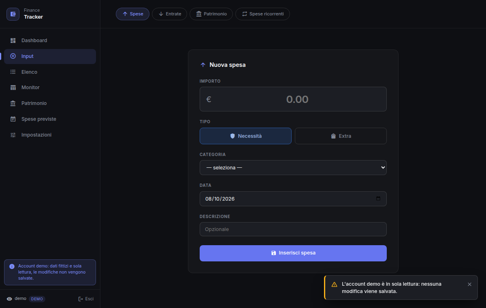

- **Login with user name + password** (the user name is not case-sensitive). The session is a signed cookie
  (HttpOnly, `SameSite=Lax`, `Secure` over HTTPS) valid for one year and renewed on every visit, so you enter the
  password once per device. *Esci* at the bottom of the sidebar logs out; changing a password logs that user out
  everywhere.
- **No public sign-up.** Users are created only from the command line (`scripts/add_user.py`).
- After 5 wrong attempts in 15 minutes for the same address **or** the same user name, the login answers `429`.
- **Requests that change data must come from this site** (the `Origin` / `Referer` is checked, on top of
  `SameSite=Lax`), so another website cannot make your browser submit a form to the app.
- **Fail closed**: in production the app refuses to start without `SECRET_KEY` and at least one user with a
  password.
- Only password **hashes** are stored — never passwords.

### Setting it up (e.g. on PythonAnywhere)

1. **Your account.** If you were already using the app with the single password (`APP_PASSWORD_HASH`), nothing
   changes: that password becomes the password of your existing user (id 1), and you log in with that user name
   (set `APP_USERNAME` to pick or change it; the default for a brand-new database is `admin`). Otherwise create
   it from the console: `python scripts/add_user.py yourname` (asks for the password). To get a hash for the
   environment variable, `python scripts/set_password.py` prints `APP_PASSWORD_HASH` and `SECRET_KEY`.
2. **WSGI file** (*Web* tab → *WSGI configuration file*), before the app is imported:

   ```python
   import os
   os.environ['SECRET_KEY'] = '...'                           # from set_password.py; keep it stable
   os.environ['APP_PASSWORD_HASH'] = 'scrypt:32768:8:1$...'   # only needed the first time (see above)
   os.environ['APP_USERNAME'] = 'yourname'                    # optional
   # os.environ['FINANCE_DB'] = '/home/<user>/finance_app/data/finance.db'   # optional

   from app import create_app
   application = create_app()
   ```
3. Enable **Force HTTPS** on the *Web* tab (the login cookie is `Secure`: on plain `http://` browsers drop it and
   the login would seem to do nothing), then reload the web app.
4. **Demo account**, from the console, once: `python scripts/add_user.py demo --demo` (asks for a password; share
   it with whoever you want to show the app to). It shows fake data, is read-only (any attempt to save shows a
   notice) and has a note in the sidebar saying so.
5. To change a password: `python scripts/add_user.py <name> --reset`.

The database is upgraded automatically at start-up (see *Schema migrations* below), including the step that makes
the data multi-user; a copy of the old file is saved first (`finance.db.pre-v0`).

### Local development

Set `FINANCE_LOCAL=1`. Cookies no longer require HTTPS, and while the database has **no users** there is no login
at all (you enter as user 1) — handy with the demo database. As soon as a user exists, the login is required
again.

### How the isolation is enforced

Every SQL statement on personal data filters on `user_id = current_uid()`, a function that
[`db.finance_db()`](db.py) registers on each connection with the id of the logged-in user (outside a request
there is no user and it raises, so a forgotten login can never mix data). Category joins are scoped to the
expense owner. Two automatic checks guard this on every push:
`scripts/check_scoping.py` (static: any SQL on personal tables without the filter is an error) and
`scripts/smoke.py` (behavioural: two users and the demo account, each page, JSON endpoint and write action
tried against the other user's data, including guessed ids).

## Configuration

| Setting | How | Default |
| --- | --- | --- |
| Database file | `FINANCE_DB` environment variable | `data/finance.db` |
| Flask secret key | `SECRET_KEY` environment variable | required in production |
| First user's password / name | `APP_PASSWORD_HASH`, `APP_USERNAME` (only used while user 1 has no password) | — |
| Local mode | `FINANCE_LOCAL=1` | off (production) |
| Budget (essential / extra / savings) | *Impostazioni* page, per year (value + monthly / yearly, each) | not set |

Settings are stored in the `settings` table (key/value). A monthly value is converted to a yearly
one by multiplying by 12.

## How it works

- **Server-rendered Flask** with one blueprint per page; Jinja templates share a base layout with a
  fixed sidebar and an optional fixed *page bar* (70 px, aligned with the logo area) that holds the
  controls of the current page.
- **Charts** are drawn with Plotly.js in the browser. Heavy pages (Monitor, Net worth) ship raw
  data as JSON and compute views, scales and switches client-side, so changing a switch is instant.
- **Colour system** – a single source of truth in [`palette.py`](palette.py), exposed to Python,
  Jinja and JavaScript (`window.PALETTE`). Essential = blue, extra = purple, income = teal,
  savings = amber.
- **Heat-map scales** – every column (and every side total) is coloured from its own minimum to its
  own maximum in the current view, so small variations stay visible.
- **Years and "now"** – the current year is always treated as in progress: monthly averages divide
  by completed months, year-over-year comparisons use the average monthly spending of the completed
  months against the previous full year, and pace markers (the white tick on the rings) are anchored
  to today.
- **Per-user data** – every query is scoped to the logged-in user (see [Users and access](#users-and-access)).

## Robustness and development

- **Input validation** – everything that comes from a form or the URL goes through
  [`validators.py`](validators.py): amounts must be finite numbers (comma decimals accepted, `nan`/`inf`/absurd
  values rejected), dates must exist in the calendar, years/months/ids are range-checked, categories must exist
  (the expense *type* is always derived from the category, never trusted from the form). An invalid form value
  raises a `ValidationError`, which the app turns into a red toast, highlights the field and sends you back to
  the form. URL parameters (page, year, filters…) never fail a page: they are corrected silently.
- **Errors** – friendly 400/403/404/405 pages and a standalone 500 page that shows a short *reference*. The
  same reference is written to the log (`logs/app.log`, rotating, plus stderr; `LOG_DIR` / `LOG_LEVEL` to
  change) together with the traceback.
- **Schema migrations** – [`migrations.py`](migrations.py) keeps the schema version in the database
  (`PRAGMA user_version`); each migration runs once inside a transaction (all or nothing) and, before touching
  a database that already holds data, a copy is saved next to it (`finance.db.pre-v<N>`). They are applied
  automatically at start-up; `python scripts/migrate.py [file.db]` does it (or shows the version) by hand. To
  change the schema, add a numbered function at the end of `MIGRATIONS` — never edit an existing one.
- **Checks** – `ruff check .` (syntax errors, undefined or unused names, common bug patterns — not style) and
  `python scripts/smoke.py`, which builds a throw-away demo database and verifies that every page and JSON
  endpoint answers, an empty database works, malformed inputs never produce a 5xx or dirty the database, and a
  valid expense is stored with the right type. GitHub Actions runs both on every push. This is a smoke test, not
  a unit-test suite: it does not verify the computed figures.

## Data model

SQLite, all amounts in euros. The schema is created and upgraded by the migrations above.

| Table | Purpose | Main columns |
| --- | --- | --- |
| `users` | Accounts | `username`, `password_hash`, `is_demo`, `data_date` |
| `category` | Expense categories (per user) | `user_id`, `type` (`essential` / `extra`), `category`, `budget` |
| `expenses` | Spending | `date` (`YYYY-MM-DD`), `euro`, `category`, `description`, `type`, `user_id` |
| `incomes` | Income | `date`, `euro`, `description`, `user_id` |
| `wealth_values` | Net-worth value per month and slot | `user_id`, `anno`, `mese`, `slot`, `value` |
| `wealth_slots` | Custom slot names and visibility | `user_id`, `slot`, `label`, `visible` |
| `wealth_group_settings` | Which groups count in the total | `user_id`, `grp`, `counts` |
| `patrimonio` | Legacy fixed-column snapshot, kept untouched after migration 005 | `anno`, `mese`, `bcc`, … |
| `recurring_expenses` | Recurring rules | `day_of_month`, `euro`, `category`, `auto_insert`, `active` |
| `planned_expenses` | Planned-expense reminders | `month` (`YYYY-MM`), `euro`, `description`, `category`, `due_date` |
| `budgets` | Budget per user, year and kind | `user_id`, `year`, `kind` (`essential` / `extra` / `savings`), `value`, `period` (`mensile` / `annuale`) |
| `settings` | Key / value settings | legacy budget keys (migrated into `budgets` on first start) |

Net-worth slots and groups are defined in [`wealth.py`](wealth.py) (a slot has a stable code such as `liq_1`;
adding one is a line in `GROUPS`, no schema change). The total is computed on the fly: the sum of the groups
that count, liabilities negative. Migration 005 copies the legacy columns into slots, keeping the old labels,
so every month's total stays identical.

## Project structure

```
finance_app/
├── app.py                  # Flask app factory, blueprint registration
├── config.py               # Paths and environment configuration
├── db.py                   # SQLite connection helper + auto-created tables
├── helpers.py              # Shared queries and utilities
├── wealth.py               # net-worth slots, groups and total rule
├── palette.py              # Colour palette (Python / Jinja / JS)
├── demo_data.py            # synthetic data for the demo account and the screenshots
├── validators.py           # parsing/validation of every form field and URL parameter
├── migrations.py           # versioned schema migrations (PRAGMA user_version)
├── import_spese.py         # CSV expense importer
├── pyproject.toml          # ruff configuration (real errors only, not style)
├── .github/workflows/ci.yml  # lint + smoke check on every push
├── blueprints/
│   ├── dashboard.py        # /              six-panel landing page
│   ├── input.py            # /input         forms + recurring rules
│   ├── elenco.py           # /elenco        filterable list, edit, delete
│   ├── monitor.py          # /monitor       month × category heat-map
│   ├── grafici.py          # /grafici       Sankey and sunburst
│   ├── auth.py             # login/logout, current user, read-only demo, origin check
│   ├── patrimonio.py       # /patrimonio    net worth (slots, see wealth.py)
│   ├── previste.py         # /previste      planned expenses
│   └── impostazioni.py     # /impostazioni  categories, budget, goal
├── templates/              # Jinja templates (one per page + base.html)
├── static/                 # style.css, main.js (modals, tabs, sidebar)
├── scripts/
│   ├── make_demo_db.py     # synthetic demo database
│   ├── add_user.py         # creates users (incl. the demo account) / resets a password
│   ├── set_password.py     # generates APP_PASSWORD_HASH and SECRET_KEY
│   ├── check_scoping.py    # static check: SQL on personal data must filter by user
│   ├── migrate.py          # applies / shows the schema version
│   ├── smoke.py            # pages, JSON endpoints and malformed inputs must never give a 5xx
│   └── screenshots.py      # README screenshots (headless Chromium)
└── docs/screenshots/       # images used by this README
```

## Regenerating the screenshots

The screenshots are produced from the demo database with a headless Chromium driven through the
DevTools protocol (`pip install websocket-client`; Chromium or Chrome must be installed):

```bash
python scripts/make_demo_db.py demo.db
python scripts/screenshots.py demo.db
```

The script starts the app on port 5055, opens each page at a fixed viewport, clicks the switches
needed for the alternative views and writes PNG files to `docs/screenshots/`.

## Limitations

- Personal use: accounts are created from the command line (no sign-up, no password reset by e-mail, no roles).
- The UI is in Italian only.
- Charts need internet access to load Plotly.js, fonts and icons from CDNs.
- Dark theme only.
